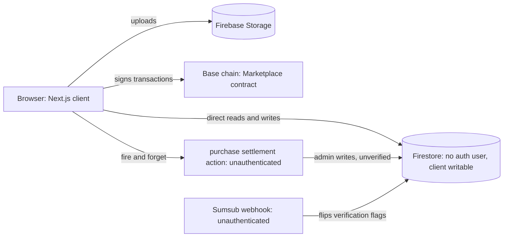
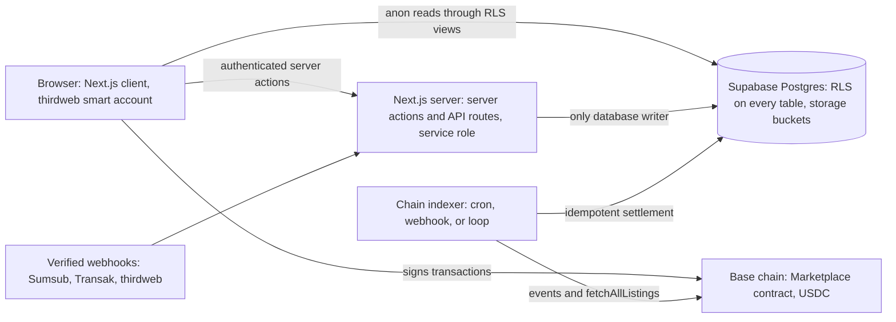

# Fractionaire Release Handover

Prepared for Med (Moods Studio) and the customer. Date: 2026-09-03.
Repository: `fractionaire/rwa_marketplace`, branch `feat/supabase-migration-onramp-e2e`.
This document is the source for the release handover PDF. Companion references: `docs/PRODUCT_KNOWLEDGE.md`, `docs/CODE_AUDIT.md`, `docs/architecture/IMPLEMENTATION_PLAN.md`, `docs/architecture/ONRAMP.md`, `MIGRATION_NOTES.md`.

---

## 1. Summary of the release

This release migrates the Fractionaire RWA marketplace from the legacy DesertTech codebase to a production-ready architecture owned by the Fractionaire organisation. The frontend remains the existing Next.js 15 application with the MUI theme and thirdweb v5 wallet stack. Everything behind it has been rebuilt.

The database moves from Firebase Firestore, which the browser wrote to directly with no authenticated user, to Supabase Postgres with row level security on every table. The browser now only reads through RLS-scoped views; every write goes through authenticated server actions running with the service role. A chain indexer is now the single authority for on-chain settlement: it ingests contract events and listing state from the Base chain, settles orders idempotently, and reconciles holdings, replacing an unauthenticated settlement endpoint that trusted whatever the browser sent. A fiat on-ramp is integrated behind a provider-agnostic interface, with Transak as the production default (thirdweb Pay does not support UAE users), thirdweb Bridge.Onramp as a selectable alternative, and a deterministic mock for tests. Businesses can now save draft listings, shown as Coming soon cards, before minting. The three critical security defects found in the code audit (an unauthenticated Sumsub webhook, an unauthenticated purchase settlement action, and an unverified JWT decode in the KYC session route) are fixed, along with session cookie hardening and the removal of a hardcoded API key.

The smart contract repositories were mirrored with full history into the `fractionaire` GitHub organisation, and the contract source is vendored into `contracts/` in this repository (14 of 14 Hardhat tests pass). The build is green: zero TypeScript errors, lint passing, 161+ Jest tests passing, and a Playwright end to end suite that drives the full business and investor journeys against a local chain with the real indexer running.

What remains before production: wiring real credentials (section 6), activating a Transak partner account, deploying to Vercel (deployment was tested locally only, by explicit decision), and the recommended contract upgrade for resale events (section 9).

---

## 2. What changed and why

### Firestore to Supabase

The legacy application stored all data in Firestore and wrote to it directly from the browser without any Firebase Auth user, protected only by security rules that were not in the repository. Roughly 60 browser call sites performed economic writes (mints, sales, transfers, purchase records) client side. This release replaces Firestore entirely with Supabase Postgres: a normalized schema of 14 tables and 3 views (section 4), checked-in migrations, generated TypeScript types, and a repository layer in `src/lib/db` that is the only database writer. All Firebase packages and client code are deleted.

### Chain indexer

The legacy settlement path was a fire-and-forget server action the browser called after a purchase, with no authentication, no on-chain verification, and non-transactional writes. It is deleted. Settlement is now owned by the chain indexer (`src/lib/indexer`, `scripts/indexer.ts`): it ingests NFTFractionalized, FractionBought, RoyaltyDistributed and ERC20 Transfer events, polls `fetchAllListings` for primary listing truth (the deployed contract emits no events for resale operations), and settles orders idempotently on the unique key (tx_hash, log_index). It runs as a Vercel cron (`vercel.json`), via the `/api/chain-webhook` endpoint for thirdweb Insight pushes, or as a local loop. A purchase completed while the browser is closed is still settled correctly, and `scripts/reconcile-chain.ts` verifies database state against the chain.

### Fiat on-ramp

Card purchases run through an `OnrampProvider` interface (`src/lib/onramp`). Research during this release found that thirdweb Pay lists the United Arab Emirates as an unsupported region, while Transak supports UAE users and AED. The user decision recorded in `docs/architecture/ONRAMP.md` is therefore: Transak is the production default provider (fully implemented, needs partner credentials to activate), thirdweb Bridge.Onramp remains implemented and selectable, and a mock provider serves test mode. On-ramp sessions are persisted, webhook signatures are verified, and the order state machine (created, awaiting_funds, funded, submitted, settled, failed, expired) ties fiat funding to on-chain settlement.

### Draft listings

Listing creation used to be one-shot: form straight to on-chain mint. Businesses can now save an asset as a draft, edit it, and see it in the marketplace as a Coming soon card before minting. Mint and list promotes the draft through minting to active, with the indexer filling in the on-chain identifiers from the mint transaction.

### Security model

- Client writes removed. The browser never writes to the database. Server actions require an authenticated session (`requireUser`) and run on the repository layer with a uniform result contract.
- Row level security. Every table has RLS enabled. Anonymous and authenticated clients can read only what their policies allow (active listings and public marketplace data for everyone, own rows for the owner); the resale book, orders and holdings are invisible across users. Indexer tables have RLS with no policies, so they are service-role only.
- Webhook verification. The Sumsub webhook verifies the `x-payload-digest` HMAC; the Transak webhook verifies the signed JWT payload; the thirdweb onramp webhook verifies the Bridge signature; the chain webhook and the indexer cron routes require shared secrets.
- Session hardening. The session cookie is HttpOnly, Secure and SameSite. The KYC session route verifies JWT signatures instead of decoding them blind. The user type is server-controlled. The hardcoded exchange rate API key was moved to an environment variable and must be rotated.

---

## 3. Architecture before and after

### Before (legacy)



### After (this release)



### Purchase data flow, step by step

USDC path:

1. The investor opens the buy flow on an asset page and enters a fraction quantity. If the asset requires KYC and the investor is unverified, the flow is blocked with a KYC gate.
2. The server action `createBuyOrder` quotes fills from active listings, cheapest first, computes the platform fee, and inserts an `orders` row with status `created`.
3. The browser signs `approve` (USDC) and `buyFractions` with the investor's smart account and sends them to the chain.
4. The browser posts the transaction hash via `submitOrderTx`; the order moves to `submitted`.
5. The indexer observes the FractionBought event and the ERC20 Transfer logs in that transaction, decrements listing quantities, updates both parties' holdings, marks the order `settled`, and writes `transactions` ledger rows. A reverted transaction moves the order to `failed`; a sweeper expires stale orders.
6. The portfolio, dashboard and history screens read the settled state through the RLS views.

Card path (on-ramp):

1. Steps 1 and 2 as above; the buyer chooses the card tab.
2. `POST /api/onramp/create` creates a provider session (Transak by default), inserts an `onramp_sessions` row, and moves the order to `awaiting_funds`. The buyer is sent to the provider's hosted widget; delivery is locked to the buyer's own wallet.
3. The buyer pays. The provider notifies completion through the signature-verified webhook `POST /api/onramp/webhook`, with server-side status polling as a fallback. Exactly one of the two paths wins the guarded transition.
4. On completion the order moves to `funded` and an `onramp` ledger row is written. USDC is now in the buyer's wallet.
5. The client executes the on-chain purchase, and from here the flow is identical to the USDC path steps 3 to 6. A failed or canceled session moves the order to `failed` with a reason; a funded or later order is never regressed.

---

## 4. Full database schema

All tables live in the `public` schema, carry uuid primary keys and trigger-maintained timestamps, store wallet addresses lowercase, and have row level security enabled. Migrations: `supabase/migrations/`.

| Table | Explanation |
|---|---|
| users | One row per wallet: retail or business type, profile fields, settings, and the server-controlled `is_verified` KYC/KYB flag. |
| business_profiles | Public-safe subset of business users (display name, logo) so anonymous marketplace visitors never read the users table. |
| kyc_identities | Sumsub applicant records per user: provider id, status (pending, approved, rejected, reset) and the raw webhook payload. |
| asset_categories | The 16 asset classes with their per-category form field schemas as jsonb; drives listing forms and marketplace filters. |
| assets | One row per asset from draft through minting to active, sold_out or delisted: on-chain nft id, fraction token address, supply, pricing, KYC requirement. |
| listings | Primary and secondary sale offers: lister, quantity, price per fraction, and status (active, filled, canceled). |
| holdings | Fraction balances per user and asset, with locked quantity for open resale listings and average entry price; reconciled against chain balances. |
| orders | The purchase state machine (created, awaiting_funds, funded, submitted, settled, failed, expired) with quoted fills, fees and the settlement tx hash. |
| onramp_sessions | One row per fiat on-ramp session: provider, provider session id, fiat and token amounts, status, raw provider payload. |
| transactions | The append-only ledger: mint, buy, sell_list, unlist, price_update, transfer and onramp rows, unique on (tx_hash, log_index). |
| chain_events | Raw contract events ingested by the indexer, unique on (chain_id, tx_hash, log_index), with processing status and errors. |
| audit_log | Server-side audit trail of privileged actions: actor, action, entity and diff. |
| indexer_cursors | Last ingested block per chain and contract, so indexer restarts never skip a block range. |

Views (read models):

| View | Explanation |
|---|---|
| v_marketplace | Public marketplace catalogue: purchasable assets with category, business display name, floor price and listed quantity. |
| v_portfolio | The caller's holdings joined with asset and valuation data; RLS of the caller decides visibility. |
| v_business_dashboard | Per-asset sales, supply and fundraising figures for the owning business; RLS-scoped to the owner. |

---

## 5. Function inventory

Every function from the release checklist, both roles. Status reflects the state at the time of writing: implemented, unit tested, and covered by the Playwright end to end suite. Demo links are recorded after the demo recording phase.

### Business functions

| # | Function | Status | Demo |
|---|---|---|---|
| 1 | Register | Implemented | VIDEO_LINK_PENDING |
| 2 | Complete profile | Implemented | VIDEO_LINK_PENDING |
| 3 | Sumsub KYB verification, webhook flips is_verified | Implemented | VIDEO_LINK_PENDING |
| 4 | Create draft listing | Implemented | VIDEO_LINK_PENDING |
| 5 | Edit draft listing | Implemented | VIDEO_LINK_PENDING |
| 6 | Upload images and documents | Implemented | VIDEO_LINK_PENDING |
| 7 | Mint and list (primary listing) | Implemented | VIDEO_LINK_PENDING |
| 8 | Dashboard with own assets, listings, sales and buyers | Implemented | VIDEO_LINK_PENDING |
| 9 | Update listing metadata | Implemented | VIDEO_LINK_PENDING |
| 10 | Update primary price | Implemented | VIDEO_LINK_PENDING |
| 11 | Delist remaining fractions | Implemented | VIDEO_LINK_PENDING |
| 12 | See transactions and revenue | Implemented | VIDEO_LINK_PENDING |
| 13 | Settings | Implemented | VIDEO_LINK_PENDING |

### Investor functions

| # | Function | Status | Demo |
|---|---|---|---|
| 1 | Register | Implemented | VIDEO_LINK_PENDING |
| 2 | Complete profile | Implemented | VIDEO_LINK_PENDING |
| 3 | Optional Sumsub KYC verification | Implemented | VIDEO_LINK_PENDING |
| 4 | Browse marketplace | Implemented | VIDEO_LINK_PENDING |
| 5 | Filter by class and per-class fields | Implemented | VIDEO_LINK_PENDING |
| 6 | View asset and documents | Implemented | VIDEO_LINK_PENDING |
| 7 | Buy with USDC | Implemented | VIDEO_LINK_PENDING |
| 8 | Buy with another token via swap | Implemented | VIDEO_LINK_PENDING |
| 9 | Buy with card via on-ramp | Implemented; production activation needs Transak partner credentials (section 9) | VIDEO_LINK_PENDING |
| 10 | KYC-gated asset blocked when unverified, allowed when verified | Implemented | VIDEO_LINK_PENDING |
| 11 | Portfolio with holdings and average entry price | Implemented | VIDEO_LINK_PENDING |
| 12 | List fractions for sale (resale) | Implemented | VIDEO_LINK_PENDING |
| 13 | Update resale listing price | Implemented | VIDEO_LINK_PENDING |
| 14 | Unlist | Implemented | VIDEO_LINK_PENDING |
| 15 | Transfer fractions to another user | Implemented | VIDEO_LINK_PENDING |
| 16 | Transaction history | Implemented | VIDEO_LINK_PENDING |
| 17 | Settings | Implemented | VIDEO_LINK_PENDING |
| 18 | Display currency conversion | Implemented | VIDEO_LINK_PENDING |
| 19 | Logout and login again with state intact | Implemented | VIDEO_LINK_PENDING |

### System guarantees

| # | Guarantee | Status | Demo |
|---|---|---|---|
| 1 | Indexer reconciles a purchase completed while the browser was closed | Implemented, covered by e2e system spec | VIDEO_LINK_PENDING |
| 2 | Two concurrent buyers of the last fractions: exactly one order settles, the other fails with a clear message | Implemented, covered by e2e system spec | VIDEO_LINK_PENDING |
| 3 | RLS blocks a user from reading another user's holdings | Implemented, covered by e2e RLS spec | VIDEO_LINK_PENDING |

---

## 6. Environment variables

All variables are documented with comments in `.env.example`. "Required" means required for the production deployment.

| Name | Purpose | Where to obtain | Required in production |
|---|---|---|---|
| NEXT_PUBLIC_SUPABASE_URL | Supabase project URL | Supabase dashboard, Project Settings, API | Yes |
| NEXT_PUBLIC_SUPABASE_ANON_KEY | Anon (publishable) key for RLS-scoped browser reads | Supabase dashboard, Project Settings, API | Yes |
| SUPABASE_SERVICE_ROLE_KEY | Server-only key, bypasses RLS, used by the repository layer and indexer | Supabase dashboard, Project Settings, API. Med: MGS Projects org access | Yes |
| SUPABASE_JWT_SECRET | Signs the RLS tokens minted by `/api/rls-token` | Supabase dashboard, Project Settings, API, JWT Settings. Med: MGS Projects org access | Yes |
| NEXT_PUBLIC_THIRDWEB_CLIENT_ID | thirdweb client id for wallets and contract calls | thirdweb dashboard, create API key. Med must obtain or confirm access | Yes |
| THIRDWEB_SECRET_KEY | thirdweb server secret (auth, Bridge calls) | thirdweb dashboard, same API key. Med must obtain or confirm access | Yes |
| NEXT_PUBLIC_THIRDWEB_CHAIN_ID | Active chain id: 8453 Base mainnet, 84532 Base Sepolia | Fixed value per environment | Yes |
| NEXT_PUBLIC_THIRDWEB_CONTRACT_ADDRESS | Marketplace proxy address (see `src/config/contracts.ts`) | Fixed: 0x511B10f9fD7d95738E372757EF85FB8a0c290f0E on Base mainnet | Yes |
| NEXT_PUBLIC_USDC_CONTRACT_ADDRESS | USDC token address on the active chain | Fixed: 0x833589fCD6eDb6E08f4c7C32D4f71b54bdA02913 on Base mainnet | Yes |
| NEXT_PUBLIC_BLOCKCHAIN_EXPLORER_URL | Explorer base URL for transaction links | Fixed: https://basescan.org for Base mainnet | Yes |
| NEXT_PUBLIC_THIRDWEB_AUTH_DOMAIN | SIWE domain shown in wallet sign-in, must match the site hostname | The production hostname | Yes |
| AUTH_PRIVATE_KEY | EVM private key that signs SIWE payloads and session JWTs | Generate a fresh dedicated key for production; never reuse the development key | Yes |
| SUMSUB_TOKEN | Sumsub app token | Sumsub dashboard, Dev space, App tokens. Med must obtain production keys | Yes |
| SUMSUB_SECRET_KEY | Sumsub app token secret | Shown once when the Sumsub app token is created. Med must obtain | Yes |
| SUMSUB_WEBHOOK_SECRET | Verifies the x-payload-digest HMAC on `/api/sumsub-webhook` | Set in the Sumsub dashboard webhook configuration. Med must obtain | Yes |
| INDEXER_RPC_URL | RPC endpoint the indexer polls for events | Node provider (Alchemy or similar) with a Base mainnet endpoint | Yes |
| EXCHANGE_RATE_API_KEY | Currency conversion for display prices | exchangerate-api.com account. Med must obtain a new key; the legacy key was hardcoded in the old source and must be rotated | Yes |
| TRANSAK_API_KEY | Transak partner API key (widget URL, order polling) | Transak partner dashboard. Med needs a KYB-approved Transak partner account | Yes (default on-ramp) |
| TRANSAK_API_SECRET | Transak partner API secret, mints access tokens for polling and webhook verification | Same Transak partner dashboard page | Yes (default on-ramp) |
| TRANSAK_ENVIRONMENT | STAGING (default) or PRODUCTION | Set to PRODUCTION once production Transak keys exist | Yes |
| CRON_SECRET | Bearer secret Vercel cron sends to `/api/indexer/run` and `/api/indexer/sweep` | Generate a long random string; Vercel sets it automatically when defined as an env var | Yes (recommended) |
| CHAIN_WEBHOOK_SECRET | Authenticates thirdweb Insight pushes to `/api/chain-webhook` | Generate; set the same value on the Insight webhook | Only if the Insight webhook is enabled |
| THIRDWEB_WEBHOOK_SECRET | Verifies thirdweb onramp webhook signatures | thirdweb dashboard when creating the webhook | Only if ONRAMP_PROVIDER=thirdweb |
| THIRDWEB_ONRAMP_PROVIDER | thirdweb fiat sub-provider: coinbase (default), stripe, transak | Optional | No |
| ONRAMP_PROVIDER | Active on-ramp provider: transak (default) or thirdweb | Optional | No (defaults to transak) |
| TEST_MODE | Enables the test auth route and mock on-ramp | Never set in production | No (must be unset) |
| NEXT_PUBLIC_TEST_MODE | Browser test wallet instead of the thirdweb in-app wallet | Never set in production | No (must be unset) |
| INDEXER_START_BLOCK, INDEXER_CONFIRMATIONS, INDEXER_MAX_BLOCKS, INDEXER_MAX_EVENTS, INDEXER_POLL_MS | Indexer tuning, sensible defaults apply | Optional | No |
| FUND_ACCOUNTS, NEXT_PUBLIC_LOCAL_MARKETPLACE_ADDRESS, NEXT_PUBLIC_LOCAL_USDC_ADDRESS | Local hardhat chain only | Local development only | No |

Production credentials are NOT included in this pull request. No secret values are committed anywhere in the repository. Med has access to the Supabase organisation (MGS Projects), where the Fractionaire project lives, and can read the service role key and JWT secret from the project settings. Med must obtain or confirm access to: thirdweb (client id and secret key for the production account), Sumsub (production app token, secret and webhook secret), a KYB-approved Transak partner account (API key and secret), and the exchange rate API key. Until each credential is wired, the corresponding integration fails fast with a clear missing-variable error rather than degrading silently.

---

## 7. Third party services

| Service | Used for | Account owner today | What the customer needs to own for production |
|---|---|---|---|
| Supabase | Postgres database, RLS, storage buckets, generated types | Project "Fractionaire" (ref ghvetmhejqjhyswldwdn, eu-central-1) lives in the MGS Projects organisation | A production project, either in the customer's own Supabase organisation or transferred from MGS Projects; billing ownership of that project |
| thirdweb | Wallets (embedded and external), SIWE auth, contract calls, optional Bridge on-ramp | Customer's account or DesertTech legacy account; to confirm. The development work used placeholder credentials | A thirdweb team owned by the customer with a production API key (client id and secret); allowed domains configured for the production hostname |
| Sumsub | KYC (investors, per asset) and KYB (businesses, at listing) | Customer's account or DesertTech legacy account; to confirm | A production Sumsub account with app token, secret, the webhook configured to the production URL, and the applicant levels used by the app |
| Transak | Fiat card on-ramp to USDC on Base (production default; UAE and AED supported) | No account exists yet; Med must create a partner account (KYB approval required for production) | The Transak partner account, its API key and secret, and the production webhook registration |
| exchangerate-api.com | Fiat display currency conversion (USD, EUR, AED) | The legacy key was hardcoded in the DesertTech source and is considered compromised | A fresh key under a customer-owned account; rotate away from the legacy key |

Ownership note: the legacy production deployment (desert-tech-rwa-marketplace.vercel.app) and the GoDaddy domains (fractionnaire.com, fractionaire.com, both expiring 2026-11-16) sit in outside accounts, almost certainly DesertTech's. The customer should secure control of the domains and decide the fate of the stale legacy deployment at cutover (see the audit, `docs/audit/deploy-state.md`).

---

## 8. Deployment runbook to production

### a. Merge the pull request

Merge the release PR into `fractionaire/rwa_marketplace` main:

```
gh pr merge <PR_NUMBER> --repo fractionaire/rwa_marketplace --squash
```

### b. Transfer or mirror the repositories to the customer organisation

Replace `ORG` with the customer's GitHub organisation. Preferred: a transfer, which preserves history, issues and settings (requires admin on the source repos and permission to create repositories in ORG; GitHub keeps redirects from the old URLs):

```
gh api repos/fractionaire/rwa_marketplace/transfer -f new_owner=ORG
gh api repos/fractionaire/rwa_marketplace_smartcontracts/transfer -f new_owner=ORG
gh api repos/fractionaire/Readmeintro/transfer -f new_owner=ORG
```

Alternative: a mirror push, which copies all branches and tags into new repositories under ORG:

```
gh repo create ORG/rwa_marketplace --private
git clone --mirror https://github.com/fractionaire/rwa_marketplace.git
git -C rwa_marketplace.git push --mirror https://github.com/ORG/rwa_marketplace.git

gh repo create ORG/rwa_marketplace_smartcontracts --private
git clone --mirror https://github.com/fractionaire/rwa_marketplace_smartcontracts.git
git -C rwa_marketplace_smartcontracts.git push --mirror https://github.com/ORG/rwa_marketplace_smartcontracts.git

gh repo create ORG/Readmeintro --private
git clone --mirror https://github.com/fractionaire/Readmeintro.git
git -C Readmeintro.git push --mirror https://github.com/ORG/Readmeintro.git
```

### c. Create the production Supabase project and apply the schema

1. Create a new Supabase project for production (do not reuse the development project ghvetmhejqjhyswldwdn, which holds e2e test data). Choose the customer's organisation if it exists, otherwise MGS Projects with a transfer later.
2. Apply the migrations in order from `supabase/migrations/`. Either link and push with the CLI:

   ```
   npx supabase link --project-ref <PROD_PROJECT_REF>
   npx supabase db push
   ```

   or apply each file in filename order through the Supabase MCP / SQL editor.
3. Seed categories only. The category seed is itself a migration (`20260903000005_seed_asset_categories.sql`) and is applied automatically by step 2; nothing further is needed. Do NOT run `scripts/seed.ts` in production: it creates test users, test assets and test listings for the e2e suite. Production data starts empty apart from the 16 asset categories.
4. Optional legacy data: the customer chose to recreate from zero, so this step is normally skipped. If legacy Firestore data is ever wanted, run `scripts/migrate-firestore-to-supabase.ts` (supports a dry run; see `scripts/README-firestore-migration.md`).
5. Run `scripts/reconcile-chain.ts` with the production environment (RPC URL, contract address, service role key) to align holdings and primary listings with the chain. On an empty database against the production contract this also reports any pre-existing on-chain state that needs backfilling.
6. Generate fresh TypeScript types if the schema ever diverges: `npx supabase gen types typescript`.

### d. Configure Vercel

1. Import `ORG/rwa_marketplace` into the customer's Vercel team from GitHub.
2. Set every environment variable from the section 6 table (all rows marked Yes, plus the conditional ones that apply). Leave TEST_MODE and NEXT_PUBLIC_TEST_MODE unset.
3. Domains: add the production domain (for example `fractionnaire.com`) and the business subdomain (`business.fractionnaire.com`); a wildcard `*.fractionnaire.com` also works. The middleware (`src/middleware.ts`) routes business pages by the `business.` host prefix, so the subdomain must point at the same deployment. Set NEXT_PUBLIC_THIRDWEB_AUTH_DOMAIN to the production hostname.
4. Crons: `vercel.json` already declares the indexer crons (`/api/indexer/run` every minute, `/api/indexer/sweep` every 10 minutes). Define CRON_SECRET as an env var so Vercel authenticates the invocations. Alternatively or additionally, enable the thirdweb Insight webhook (step e) for push-based ingestion.
5. Note: this deployment was NOT tested on Vercel in this PR. By explicit user decision, verification ran locally only (local build, local e2e stack). On the first deploy, watch: the build log for env validation failures, the cron invocations reaching `/api/indexer/run` with a 200 (check function logs), function execution time on the indexer route (raise the max duration if a large block range must catch up, or set INDEXER_START_BLOCK near the current head for a fresh database), middleware subdomain routing on the real domain, and image loading from the Supabase storage domain.

### e. Point the webhooks at the production URL

- Sumsub: in the Sumsub dashboard, configure the webhook to `https://<production-domain>/api/sumsub-webhook` and set the same signing secret as SUMSUB_WEBHOOK_SECRET (digest algorithm HMAC-SHA256, header `x-payload-digest`).
- Transak: in the Transak partner dashboard, register `https://<production-domain>/api/onramp/webhook` for order events. Verification uses the partner access token minted from TRANSAK_API_SECRET; no separate webhook secret.
- thirdweb (only if ONRAMP_PROVIDER=thirdweb): create the webhook in the thirdweb dashboard pointing at `https://<production-domain>/api/onramp/webhook` and set THIRDWEB_WEBHOOK_SECRET to its signing secret.
- thirdweb Insight (optional, push-based chain ingestion): point it at `https://<production-domain>/api/chain-webhook` with the shared secret CHAIN_WEBHOOK_SECRET.

### f. Production smoke test checklist

Run with a real wallet and a small amount of real USDC:

1. Landing page loads on the production domain; business pages load on the business subdomain.
2. Register a retail account (email login creates the embedded wallet); log out and back in; state intact.
3. Register a business account, complete the profile, pass Sumsub KYB with a real (small-scope) applicant; confirm `is_verified` flips via the webhook, not manually.
4. Create a draft listing with an image and a document; confirm the Coming soon card appears.
5. Mint and list a low-value test asset (small fraction count, minimal price). Confirm the mint transaction on Basescan and the asset turning active with a primary listing.
6. Buy a small number of fractions with USDC from the retail account. Confirm: order reaches `settled`, the holding appears in the portfolio, the business dashboard shows the sale, the transactions history shows both sides, and the row's tx hash matches Basescan.
7. Card path: create a card purchase through Transak (staging first if production keys are not yet live; a real small card purchase once they are). Confirm the session completes via webhook and the order reaches `funded` and then `settled` after the on-chain purchase.
8. Resell a fraction from the retail account, buy it from a second account, confirm royalty and both portfolios update.
9. Transfer a fraction between two accounts; confirm holdings move and the ledger direction is correct.
10. Run `scripts/reconcile-chain.ts` against production; require zero unexplained diffs.
11. Check the Vercel function logs for the two crons over 15 minutes: `/api/indexer/run` succeeding every minute, no errors accumulating in `chain_events.error`.

### g. Rollback plan

- Application: revert the merge commit on main (`git revert -m 1 <merge-sha>` and push) or use Vercel's instant rollback to the previous production deployment. Both leave the database untouched.
- Database: restore the Supabase project from a backup or point-in-time recovery (PITR is available on paid plans; enable it before go-live). For surgical issues prefer targeted SQL fixes over full restores, because on-chain state cannot be rolled back.
- Indexer: to replay a block range, rewind the cursor (`update indexer_cursors set last_block = <block> where chain_id = 8453`). Re-ingestion is idempotent: `chain_events` and `transactions` are unique on (tx_hash, log_index), so replays never double-settle.
- On-ramp: set ONRAMP_PROVIDER or disable the card tab via the provider config if Transak misbehaves; USDC purchases are unaffected.
- After any rollback, run `scripts/reconcile-chain.ts` and require zero unexplained diffs before reopening.

---

## 9. Known gaps and recommended next steps

Verification status at the time of writing: the full end to end suite passes,
37 of 37 tests in one run against a local Base-compatible chain with the
indexer live, and the chain reconciliation gate (`scripts/reconcile-chain.ts`)
exits zero with no unexplained differences between the database and the chain.
Unit tests are 167 of 167, typecheck and lint are clean, and the production
build succeeds. The gaps below are the work that remains.

1. Vercel deployment untested, by decision. The user chose to skip the Vercel preview; all verification ran locally (build, unit tests, e2e stack with local chain and indexer). The first production deploy must follow section 8d and watch the listed points.
2. thirdweb Pay unsupported for UAE, Transak is the default. thirdweb's own FAQ lists the UAE as an unsupported region, so the card on-ramp defaults to Transak. Transak is fully implemented but requires a KYB-approved partner account before it can serve real payments; the activation checklist for Med is in `docs/architecture/ONRAMP.md` section 5.4, including four provider behaviours to verify against staging.
3. Contract emits no resale events. The deployed Marketplace contract has no events for sellFractions, unlistFractions or updateListing and no resale getter, so the database is authoritative for the resale book and the indexer polls `fetchAllListings` for primary state. Recommended next step: a contract upgrade (the proxy pattern supports it) adding listing events and a resale getter, after which the indexer becomes fully event-driven.
4. Royalty distribution not surfaced. `depositRevenue` exists on the contract but has no UI in the app; the audit also found the creator is excluded from the holder list so their share leaks to the platform owner. Recommend surfacing revenue distribution together with the contract fix in the same upgrade.
5. No admin surface. There is no admin UI for category management, KYC overrides, fee configuration or listing moderation. The `audit_log` table exists and privileged actions are recorded, so an admin panel can be added without schema changes.
6. Production credentials to be wired by Med. See section 6: Supabase production project keys, thirdweb, Sumsub production keys and webhook secret, Transak partner keys, exchange rate API key (rotate the compromised legacy key), and a fresh AUTH_PRIVATE_KEY.
7. The e2e suite runs against a production build, not `next dev`. On-demand
   compilation in dev put 13 to 41 second delays inside test timeouts (measured
   on the on-ramp webhook and status routes), which made the suite flaky and,
   because the specs are serial, aborted later tests. The harness now builds
   once into `.next-e2e` and serves it, which also cut the run from about 17
   minutes to under 4. `E2E_DEV=1` restores the dev server when iterating on UI.
8. Nothing has been exercised against a public testnet or mainnet. All chain
   verification used a local node with the contracts deployed fresh. Before
   production, run the same journeys against Base Sepolia with a funded key,
   then repeat the smoke test in section 8f on mainnet with a small purchase.
9. Test-only surfaces exist behind flags and must stay disabled in production.
   `/api/test-auth` returns 404 unless `TEST_MODE=1` and it refuses to run on
   Vercel, and the local signer plus the mock on-ramp are gated on
   `NEXT_PUBLIC_TEST_MODE`. Confirm neither flag is set in the production
   environment; the build that serves the suite must never be shipped.
 See section 6: Supabase production project keys, thirdweb, Sumsub production keys and webhook secret, Transak partner keys, exchange rate API key (rotate the compromised legacy key), and a fresh AUTH_PRIVATE_KEY.

---

## 10. Where every artifact lives

| Artifact | Location |
|---|---|
| This handover document | `docs/handover/HANDOVER.md` |
| Product knowledge (Notion extraction, decisions, open questions) | `docs/PRODUCT_KNOWLEDGE.md` |
| Code audit master plus seven detail files | `docs/CODE_AUDIT.md`, `docs/audit/` |
| Implementation plan (layering, order state machine, workstreams) | `docs/architecture/IMPLEMENTATION_PLAN.md` |
| On-ramp research, decision and Transak activation checklist | `docs/architecture/ONRAMP.md` |
| Migration log (phases, decisions, credentials status) | `MIGRATION_NOTES.md` |
| Database migrations (schema, RLS, views, storage, category seed, hardening, indexer cursor) | `supabase/migrations/` |
| Test data seed (e2e only, never production) | `scripts/seed.ts` |
| Chain indexer loop | `scripts/indexer.ts`, library in `src/lib/indexer/` |
| Chain reconciliation | `scripts/reconcile-chain.ts` |
| Firestore data migration (optional, customer chose recreate from zero) | `scripts/migrate-firestore-to-supabase.ts`, `scripts/README-firestore-migration.md` |
| End to end suite and harness documentation | `e2e/`, `e2e/README.md` |
| Demo videos and index | `docs/demos/`, `docs/demos/INDEX.md` (recorded after the verification phase) |
| Smart contract source (vendored) and deployed addresses | `contracts/`, `src/config/contracts.ts` |
| Contract repository with full history | `fractionaire/rwa_marketplace_smartcontracts` on GitHub |
| Environment variable template | `.env.example` |
| Vercel cron configuration | `vercel.json` |
